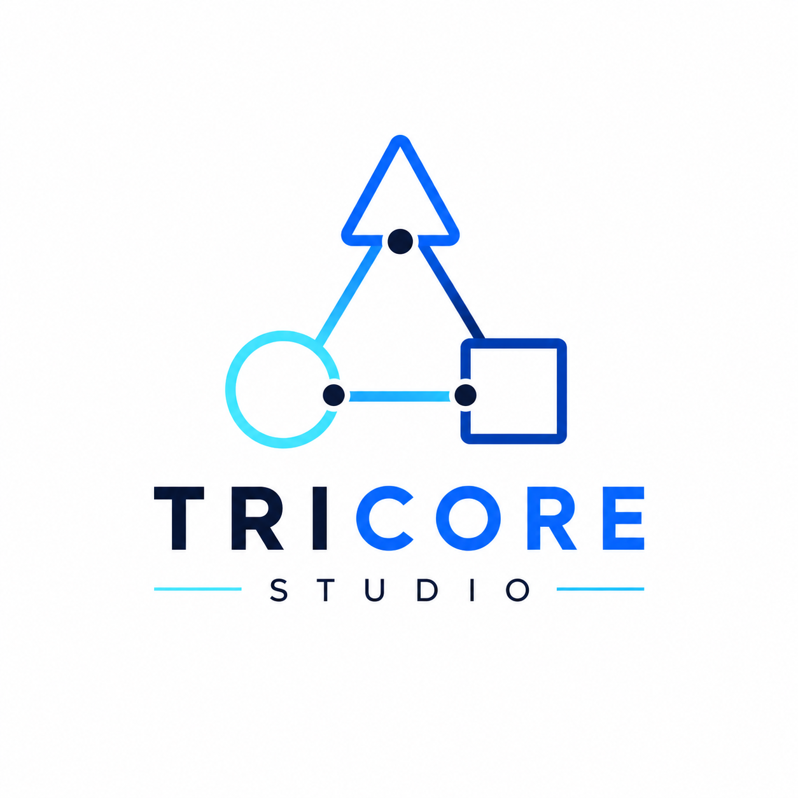

# ▲ Tricore Studio Website

<p align="center">
  
</p>

<h3 align="center">
AI • Data • Growth
</h3>

<p align="center">
A modern, responsive website built for <b>Tricore Studio</b> — an AI & digital solutions studio helping businesses automate workflows, unlock data insights, and accelerate growth.
</p>

<p align="center">
  <a href="https://www.tricorestudio.com/">Live Website</a> •
  <a href="https://www.instagram.com/tricorestudio_/">Instagram</a>
</p>


---

## 🚀 About The Project

**Tricore Studio Website** is a modern digital agency website designed to showcase AI-powered solutions, data services, automation expertise, and creative digital services.

The website focuses on creating a premium brand experience with:

- Modern UI/UX design
- Responsive layouts
- Smooth animations
- SEO optimization
- Service-focused sections
- Lead generation functionality
- Performance-focused development


The goal is simple:

> Help businesses understand how AI, automation, and data can transform their operations and growth.


---

# ✨ Features

## 🎨 Modern Design

- Clean and professional agency-style interface
- Premium dark/light visual experience
- Brand-focused typography and colors
- Mobile-first responsive design


## 🤖 AI & Automation Showcase

Highlighting solutions such as:

- AI Automation
- AI Agents
- Workflow Automation
- Business Process Optimization


## 📊 Data & Analytics Services

Showcases:

- Data Analysis
- Business Insights
- Data Visualization
- Reporting Solutions


## 🌐 Digital Growth Services

Includes:

- SEO
- Lead Generation
- Email Marketing
- Copywriting
- LinkedIn Optimization


## 💼 Professional Service Presentation

Service categories include:

- Web Development
- Portfolio Websites
- Resume Writing
- Presentation Design
- QA & Web Testing
- Research Support


## 📩 Lead Generation Contact System

Includes:

- Contact form
- Service selection
- Client inquiry collection
- Newsletter section


---

# 🛠️ Technologies Used

### Frontend

- HTML5
- CSS3
- JavaScript
- Responsive Web Design


### Design & UI

- Custom CSS animations
- Modern layout system
- Google Fonts
- SVG icons


### SEO

Implemented:

- Meta descriptions
- Open Graph tags
- Twitter Cards
- JSON-LD structured data
- Search engine friendly markup


### Deployment

Supported deployment:

- GitHub Pages
- Vercel


---

# 📂 Project Structure
```
tricorestudio-website/

│
├── assets/
│ ├── images/
│ ├── icons/
│ └── logo files
│
├── css/
│ └── style.css
│
├── js/
│ └── script.js
│
├── index.html
│
├── README.md
│
└── other pages
```


---

# ⚡ Getting Started

Follow these steps to run the project locally.

## Clone Repository

```bash
git clone https://github.com/TricoreStudio/tricorestudio-website.git

cd tricorestudio-website
```

## 📈 SEO Strategy

The website follows modern SEO practices:

✅ Optimized page titles
✅ Meta descriptions
✅ Structured data markup
✅ Mobile-friendly design
✅ Semantic HTML
✅ Fast loading performance
✅ Search engine friendly structure

Target keywords:

-AI Automation Agency
-Data Analytics Services
-Digital Solutions Agency
-Website Development Agency
-Business Automation Solutions

📄 License

This project is developed and maintained by Tricore Studio.

All rights reserved.

<p align="center"> Built with creativity, automation, and data-driven thinking 🚀 </p> 
